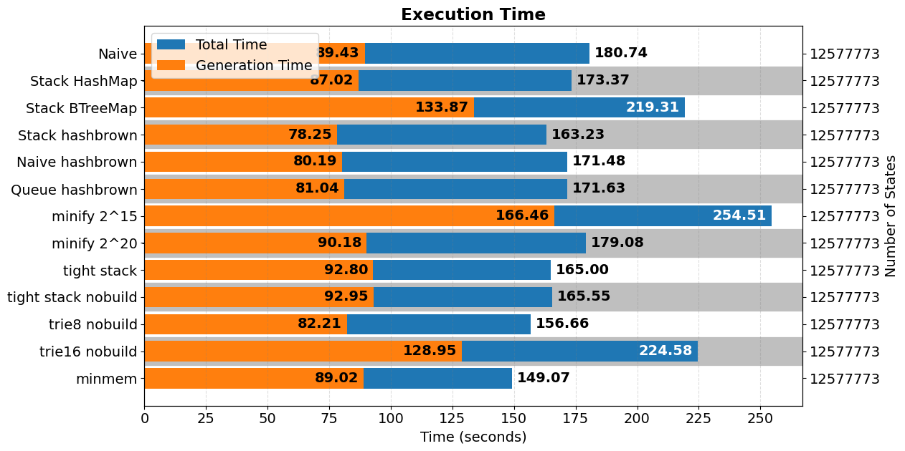

# Benchmarks

Results of the benchmarks that measure the memory and storage usage of the program.

## State Indexers Memory Usage

Benchmarking the memory usage of different state indexer implementations.

All indexers that are present in git commit `58e50ecaf353f79442426d3ee1875b12d4a7bf12`:
- `Naive`: Using `std::collections::HashMap` and storing new states in `Array2`s.
- `Stack HashMap`: Same as naive, but instead of storing new states in `Array2`s, only unexplored states are added to stack and removed. When MDP is built, `Array2`s are built from HashMap.
- `Stack BTreeMap`: Same as previous, but using `std::collections::BTreeMap`.
- `Stack hashbrown`: Same as previous, but using `hashbrown` library's `HashMap`.
- `Naive hashbrown`: `Naive` with `hashbrown`.
- `Queue hashbrown`: Same as `Stack hashbrown`, but using a queue instead of a stack.
- `minify 2^15`: Similar to `Stack hashbrown`. Removes unreachable states from the `HashMap` periodically (every `2^15` states) and adds removed states to `Array2`.
- `minify 2^20`: Same as previous with period = `2^20`.
- `tight stack`: Same as `Stack hashbrown`, but states are converted to `BitVec`s before indexing in HashMap. Uses minimum number of bits to store a state.
- `trie8`: Same as previous, but using a custom trie implementation. Each trie link holds 8 bits of information.
- `trie16`: Each trie link holds 16 bits of information.

Modifiers;
- `nobuild` in name denotes that the indexer didn't build the state `Array2` in `deconstruct` call, i.e., indexed states are left in the HashMap.

These were tested on `experiments/mem.json`.
Note that `ArrayStateIndexer` couldn't run the experiment due to horrible complexity (worst case `O(n)` for a single addition where `n` is the explored states).

In `mem2.json`, I benchmarked the best 2 implementations again: `BitStackStateIndexer` (`tight stack`) and `TrieStateIndexer` (`trie8`).
There were no significant difference between their runtime performance and memory usage.
Note that this benchmark was performed without `nobuild` unlike the previous one, after Trie iterator was implemented (commit `d14f85e36fd9aabefed0250193aaccea181589c5`).

## Size of Save File

In [storage.json](./storage.json), size of the save file is measured. `bincode` is for serialization.

Implementations:
- `vec fixint`: Using regular `Vec<BusState>` and `Vec<TeamState>` to store. Fixed integer encoding in `bincode` settings.
- `vec varint`: Varying integer encoding in `bincode` settings.
- `comp varint`: Using `Vec<BitVec>` to save states (commit 62ff5b097e463c79c6d9905fef6a51ed25e82a90).
- `comp2 varint`: Using `BitVec` to save states (commit 66d8ccf5076031bf24f05676d51cf97c578b0b93).

Transition recomputation is in `dmscli/src/commands/simulation.rs` in commit 41447a7dbc726a57c8454bdec39abfcf4b374ded.

I think the compression is not worth the decrease in performance.
Might return to this if storage becomes an issue.
Can also implement a separate subcommand for compression.
