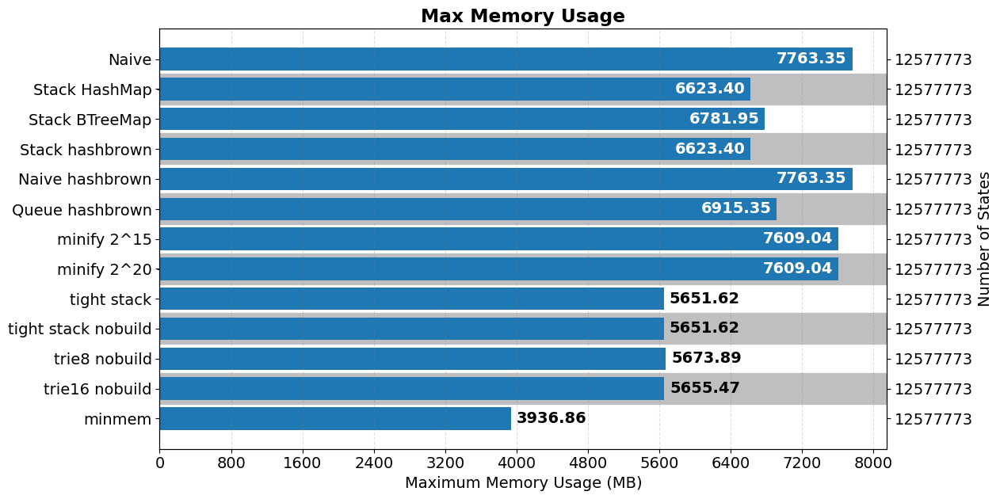
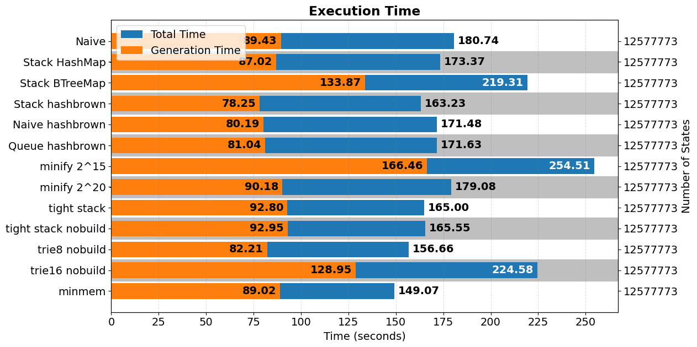

# Benchmarks

Results of the benchmarks that measure the memory and storage usage of the program.

## State Indexers Memory Usage

Benchmarking the memory usage of different state indexer implementations.

**NOTE:** All state indexers except for the best one (`BitStackStateIndexer`) have been removed to keep the codebase simple. You can checkout the commit mentioned below if you want to see all state indexer implementations.

All indexers that are present in git commit `58e50ecaf353f79442426d3ee1875b12d4a7bf12`:
- `Naive`: Using `std::collections::HashMap` and storing new states in `Array2`s.
- `Stack HashMap`: Same as naive, but instead of storing new states in `Array2`s, only unexplored states are added to stack and removed. When MDP is built, `Array2`s are built from HashMap.
- `Stack BTreeMap`: Same as previous, but using `std::collections::BTreeMap`.
- `Stack hashbrown`: Same as previous, but using `hashbrown` library's `HashMap`.
- `Naive hashbrown`: `Naive` with `hashbrown`.
- `Queue hashbrown`: Same as `Stack hashbrown`, but using a queue instead of a stack.
- `minify 2^15`: Similar to `Stack hashbrown`. Removes unreachable states from the `HashMap` periodically (every `2^15` states) and adds removed states to `Array2`.
- `minify 2^20`: Same as previous with period = `2^20`.
- `tight stack`: Same as `Stack hashbrown`, but states are converted to `BitVec`s before indexing in HashMap. Uses minimum number of bits to store a state.
- `trie8`: Same as previous, but using a custom trie implementation. Each trie link holds 8 bits of information.
- `trie16`: Each trie link holds 16 bits of information.

Modifiers;
- `nobuild` in name denotes that the indexer didn't build the state `Array2` in `deconstruct` call, i.e., indexed states are left in the HashMap.

Added in commit 7bc360ca6af5c255f91976f30bdc13fd8dea3b66:
- `minmem`: Uses smaller primitive types (e.g. `u8` for cost instead of `f64`, `u8` for bus indices instead of `usize`, etc.). Uses `tight stack` state indexer.

These were tested on `experiments/mem.json`.
Note that `ArrayStateIndexer` couldn't run the experiment due to horrible complexity (worst case `O(n)` for a single addition where `n` is the explored states).

In `mem2.json`, I benchmarked the best 2 implementations again: `BitStackStateIndexer` (`tight stack`) and `TrieStateIndexer` (`trie8`).
There were no significant difference between their runtime performance and memory usage.
Note that this benchmark was performed without `nobuild` unlike the previous one, after Trie iterator was implemented (commit `d14f85e36fd9aabefed0250193aaccea181589c5`).

## Size of Save File

In [storage.json](./storage.json), size of the save file is measured. `bincode` is for serialization.

Implementations:
- `vec fixint`: Using regular `Vec<BusState>` and `Vec<TeamState>` to store. Fixed integer encoding in `bincode` settings.
- `vec varint`: Varying integer encoding in `bincode` settings.
- `comp varint`: Using `Vec<BitVec>` to save states (commit 62ff5b097e463c79c6d9905fef6a51ed25e82a90).
- `comp2 varint`: Using `BitVec` to save states (commit 66d8ccf5076031bf24f05676d51cf97c578b0b93).

Transition recomputation is in `dmscli/src/commands/simulation.rs` in commit 41447a7dbc726a57c8454bdec39abfcf4b374ded.

I think the compression is not worth the decrease in performance.
Might return to this if storage becomes an issue.
Can also implement a separate subcommand for compression.
